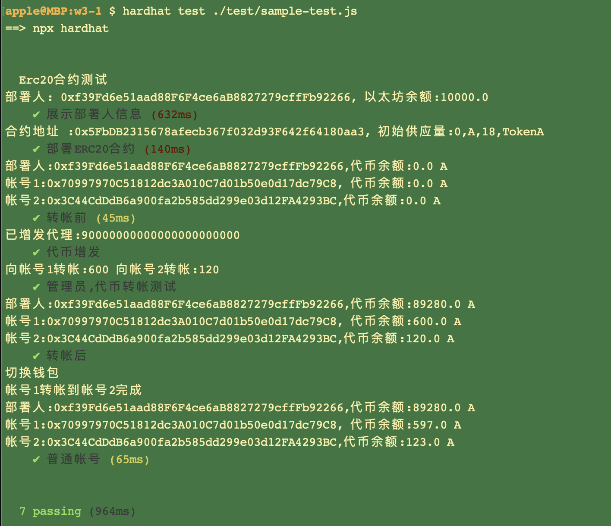
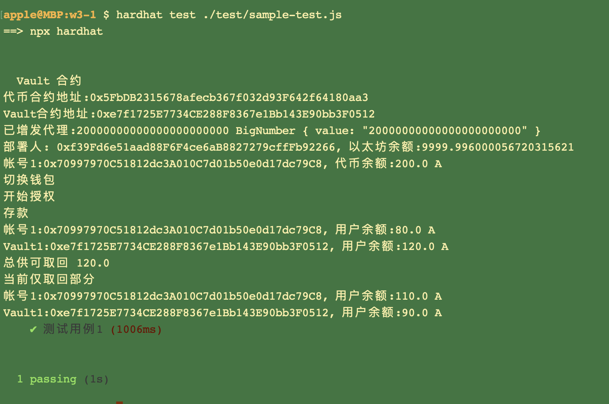

# Basic Sample Hardhat Project

This project demonstrates a basic Hardhat use case. It comes with a sample contract, a test for that contract, a sample script that deploys that contract, and an example of a task implementation, which simply lists the available accounts.

Try running some of the following tasks:

```shell
npx hardhat accounts
npx hardhat compile
npx hardhat clean
npx hardhat test
npx hardhat node
node scripts/sample-script.js
npx hardhat help
```


# W3_1作业
* 发⾏⼀个 ERC20 Token：
  * 可动态增发（起始发⾏量是 0）
  * 通过 ethers.js 调⽤合约进⾏转账

* 编写⼀个 Vault 合约：
  * 编写 deposite ⽅法，实现 ERC20 存⼊ Vault，并记录每个⽤户存款⾦额 ， ⽤从前端调⽤（Approve，transferFrom）
  * 编写 withdraw ⽅法，提取⽤户⾃⼰的存款 （前端调⽤）
  * 前端显示⽤户存款⾦额


## 测试方法：
    npx hardhat test ./test/sample-test.js

## 截图
- ERC20部署，增发，转帐



- Vault 存取款


