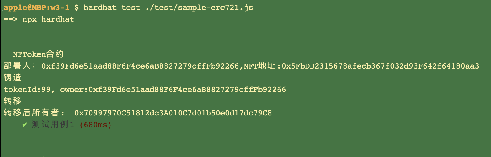

# Basic Sample Hardhat Project

This project demonstrates a basic Hardhat use case. It comes with a sample contract, a test for that contract, a sample script that deploys that contract, and an example of a task implementation, which simply lists the available accounts.

Try running some of the following tasks:

```shell
npx hardhat accounts
npx hardhat compile
npx hardhat clean
npx hardhat test
npx hardhat node
node scripts/sample-script.js
npx hardhat help
```


W3_2作业
* 发行一个 ERC721 Token
   * 使用 ether.js 解析 ERC721 转账事件(加分项：记录到数据库中，可方便查询用户持有的所有NFT)
   * (或)使用 TheGraph 解析 ERC721 转账事件


## 测试方法：
    npx hardhat test ./test/sample-erc721.js

## 截图
-


